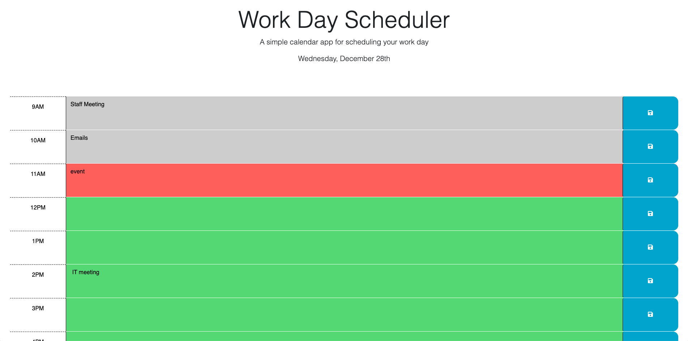

# Project: Work Day Planner utilizing Third Party APIs

## Project Description: Create a Daily Calendar Planner

- The goal of this project was to create a simple calendar application that allows a user to save events for each hour of the day.

- The app runs in the browser and features dynamically updated HTML and CSS powered by jQuery.

- It the utilizes [Day.js](https://day.js.org/en/) library interact with date and time. 

- Each day the header updates with the day of the week, the numerical day of the month, and the month when it changes.

- The text area element of each hour of the workday (9am - 5pm) color codes to indicate past, present, and future time blocks using grey, red, and green respectively and updates every hour (upon refresh) using dayjs().hour().  

- Event descriptions can be saved to local storage using the save button to the right of each time block text area and will remain in place upon refresh or navigation away from and back to the page.

## User Story

- AS AN employee with a busy schedule
- I WANT to add important events to a daily planner
- SO THAT I can manage my time effectively

## Acceptance Criteria

- GIVEN I am using a daily planner to create a schedule
- WHEN I open the planner
- THEN the current day is displayed at the top of the calendar
- WHEN I scroll down
- THEN I am presented with timeblocks for standard business hours
- WHEN I view the timeblocks for that day
- THEN each timeblock is color coded to indicate whether it is in the past, present, or future
- WHEN I click into a timeblock
- THEN I can enter an event
- WHEN I click the save button for that timeblock
- THEN the text for that event is saved in local storage
- WHEN I refresh the page
- THEN the saved events persist

## Screenshot of Deployed Application

## Installation & Usage

Installation & usage is simply through loading the public url into your browswer search bar and using the links to navigate.

## Links 

Link to deployed site:
https://altb22.github.io/Work_Day_Scheduler/

Link to GitHub Repository:
https://github.com/AltB22/Work_Day_Scheduler

## Credits

Built by William Massie in collaboration and guidance from UC Berkeley Ext Coding Boot Camp students and staff. 

## License

MIT License

Copyright (c) 2022 William Massie

Permission is hereby granted, free of charge, to any person obtaining a copy
of this software and associated documentation files (the "Software"), to deal
in the Software without restriction, including without limitation the rights
to use, copy, modify, merge, publish, distribute, sublicense, and/or sell
copies of the Software, and to permit persons to whom the Software is
furnished to do so, subject to the following conditions:

The above copyright notice and this permission notice shall be included in all
copies or substantial portions of the Software.

THE SOFTWARE IS PROVIDED "AS IS", WITHOUT WARRANTY OF ANY KIND, EXPRESS OR
IMPLIED, INCLUDING BUT NOT LIMITED TO THE WARRANTIES OF MERCHANTABILITY,
FITNESS FOR A PARTICULAR PURPOSE AND NONINFRINGEMENT. IN NO EVENT SHALL THE
AUTHORS OR COPYRIGHT HOLDERS BE LIABLE FOR ANY CLAIM, DAMAGES OR OTHER
LIABILITY, WHETHER IN AN ACTION OF CONTRACT, TORT OR OTHERWISE, ARISING FROM,
OUT OF OR IN CONNECTION WITH THE SOFTWARE OR THE USE OR OTHER DEALINGS IN THE
SOFTWARE.